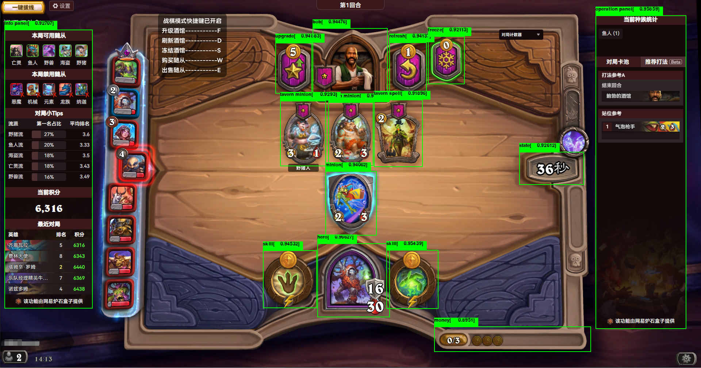

# 

- [English](README_en.md)
- [Zh](README.md)
## 
👋Introduction

AutoHS is a project that aims to automate the gameplay of Hearthstone, using yolo vision techniques.

基于[yolov8](https://github.com/ultralytics/ultralytics)和[paddleOCR](https://github.com/PaddlePaddle/PaddleOCR)的纯视觉方案炉石自动化。使用[pyautogui](https://github.com/asweigart/pyautogui)实现自动操作。

## 
🚩Features

- 视觉识别战棋物体
- 自动操作

 
  

## 
⚙️Installation

### CPU(Recommended)
~~~bash
git clone https://github.com/Joooook/AutoHearthStone
pip install -r cpu_requirements.txt
~~~

### GPU
自行安装对应GPU版本的[pytorch](https://github.com/pytorch/pytorch)和[paddle](https://github.com/PaddlePaddle/Paddle)，然后安装剩余依赖。

注意pytorch和paddle的兼容问题，安装相同显卡驱动的版本。（以11.8为例，如果你的nvdia驱动是12.x，此方法将不适用，paddle跟torch）
~~~bash
conda install pytorch==2.5.1 torchvision==0.20.1 torchaudio==2.5.1  pytorch-cuda=11.8 -c pytorch -c nvidia
conda install paddlepaddle-gpu==3.0.0rc1 paddlepaddle-cuda=11.8 -c paddle -c nvidia
~~~
安装剩余依赖
~~~bash
git clone https://github.com/Joooook/AutoHearthStone
pip install -r gpu_requirements.txt
~~~

## 
▶️Quick Start

### CLI
~~~bash
python main.py
~~~

### Python

~~~python
from AutoHearthStone import AutoBattleGrounds

AutoBattleGrounds((1920, 1080), "runs/detect/train/weights/best.pt", "runs/segment/train4/weights/best.pt",
                  "runs/detect/card/weights/best.pt").run()
~~~

### Executable File

下载编译好的release，在config.yaml中进行配置
~~~yaml
# 配置文件示例

size: [1920, 1080]  # 窗口大小，根据本机实际分辨率进行调整

# 模型路径配置，请勿随意替换
object_model_path: "runs/detect/train/weights/best.pt"
hand_model_path: "runs/segment/train4/weights/best.pt"  # 手牌识别
card_model_path: "runs/detect/card/weights/best.pt"   # 卡牌识别

# 其他配置项
threshold: 0.5    # 视觉识别阈值
drag_duration: 0.2  # 拖动操作时长
interval: 0.8     # 操作间隔时长
enable_sort: true  # 是否启用排序功能。（实验性功能，谨慎使用。）
~~~
配置完成后启动main.exe即可。

## 
⚠️Notice

- 已知问题
  - 酒馆随从的排序功能不稳定
  - 不兼容马林的饰品购买
- 本项目仅能在Windows平台运行.
- 本项目仅在Python 3.11进行过测试。
- 本项目所提供的所有代码和资源仅供教育用途和个人学习之用。一切使用该脚本造成的不良后果均与本人无关。

## 
👉️Reference

- [ultralytics/ultralytics](https://github.com/ultralytics/ultralytics)
- [PaddlePaddle/PaddleOCR](https://github.com/PaddlePaddle/PaddleOCR)
- [asweigart/pyautogui](https://github.com/asweigart/pyautogui)
## 
💭Murmurs

本项目仅用于学习，欢迎催更。

## 
☕️Donate

请我喝杯奶茶吧。

 

